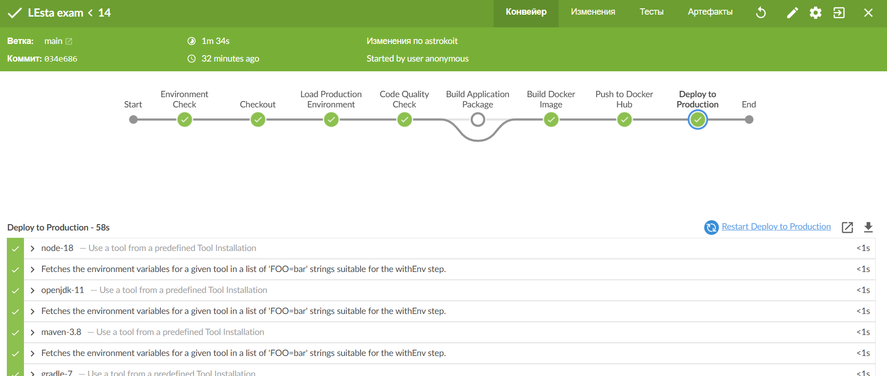
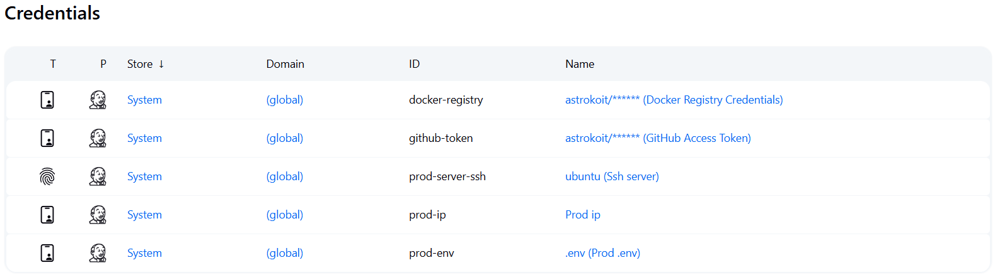
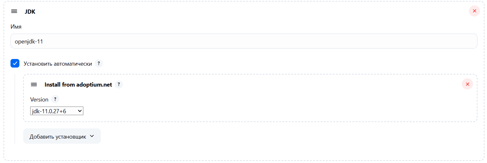
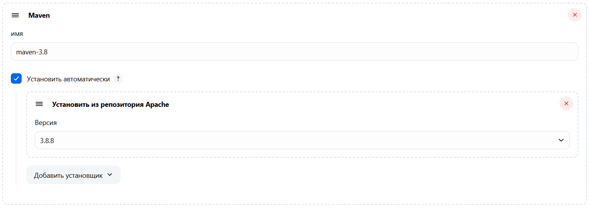
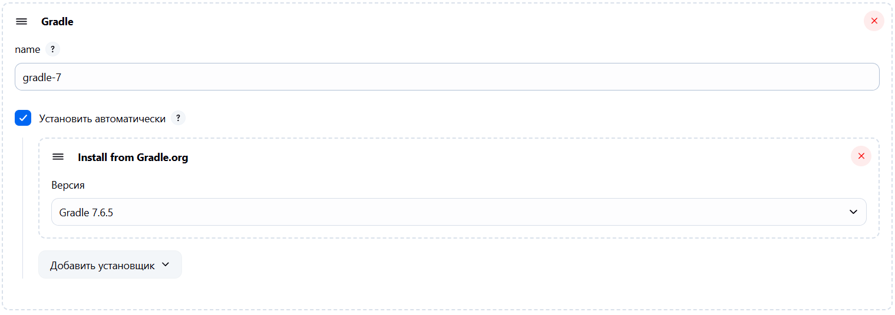
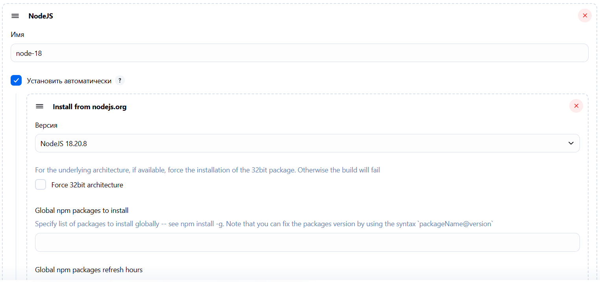
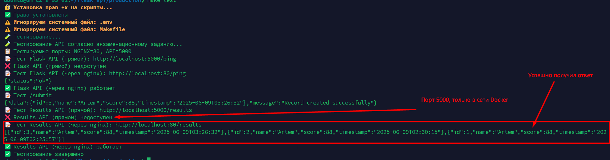

Выполнил Зинченко Андрей в рамках экзаменационного задания

# Flask API с PostgreSQL, Jenkins и Nginx - Полный CI/CD Stack

# Содержание
1. [Структура проекта](#структура-проекта)
2. [Архитектура и сборка](#архитектура-и-сборка)
3. [Локальная разработка](#локальная-разработка)
4. [Продакшн развертывание](#продакшн-развертывание)
5. [Реверс-прокси и SSL](#реверс-прокси-и-ssl)
6. [CI/CD Pipeline](#cicd-pipeline)
7. [Настройка Jenkins](#настройка-jenkins)
8. [Проблемы и рекомендации](#проблемы-и-рекомендации)

# Структура проекта

```
.
├── Dockerfile                    # Образ для Flask веб-приложения
├── Dockerfile.jenkins            # Кастомный образ Jenkins с Docker CLI
├── Jenkinsfile                   # CI/CD pipeline конфигурация
├── Makefile                      # Команды для управления проектом
├── README.md                     # Документация проекта
├── app                           # Flask приложение
│   ├── app.py                    # Точка входа приложения
│   ├── app_factory.py            # Factory pattern для Flask app
│   ├── configs                   # Конфигурации приложения
│   │   ├── __init__.py
│   │   ├── app_config.py         # Основные настройки Flask
│   │   └── postgres_config.py    # Настройки подключения к PostgreSQL
│   ├── models                    # SQLAlchemy модели
│   │   └── score_recorder.py     # Модель для записи результатов
│   ├── routes.py                 # API эндпоинты
│   ├── utils.py                  # Вспомогательные функции
│   └── validators.py             # Валидация входных данных
├── docker-compose.yml            # Оркестрация всех сервисов
├── nginx                         # Конфигурация reverse proxy
│   ├── nginx.conf                # Основная конфигурация nginx
│   └── templates                 # Шаблоны конфигураций
│       └── default.conf.template # Шаблон виртуального хоста
├── requirements.txt              # Python зависимости
├── scripts                       # Скрипты управления
│   ├── backup.sh                 # Бэкап базы данных
│   ├── build.sh                  # Сборка образов
│   ├── clean.sh                  # Очистка системы
│   ├── dev.sh                    # Запуск development окружения
│   ├── generate-ssl.sh           # Генерация SSL сертификатов
│   ├── logs.sh                   # Просмотр логов
│   ├── prod.sh                   # Запуск production окружения
│   ├── setup.sh                  # Первоначальная настройка
│   ├── status.sh                 # Статус сервисов
│   ├── stop.sh                   # Остановка сервисов
│   └── test.sh                   # Тестирование API
└── volumes                       # Persistent данные
```

# Архитектура и сборка

## Компоненты системы
- **Flask API (web):** Python 3.10, Gunicorn, SQLAlchemy
- **PostgreSQL (db):** База данных с оптимизированными настройками
- **Jenkins (exam_jenkins):** CI/CD с Docker CLI интеграцией  
- **Nginx (exam_nginx):** Reverse proxy с SSL termination

## Процесс сборки
Сборка образов происходит через `docker build` с использованием:
- **Dockerfile** - для Flask веб-приложения
- **Dockerfile.jenkins** - для Jenkins с предустановленным Docker CLI

**Особенности сборки:**
```
# Сборка через Makefile
make build

# Или напрямую через docker-compose
docker-compose build --no-cache
```

## Установка плагинов Jenkins
⚠️ **ВАЖНО:** Плагины Jenkins необходимо устанавливать вручную, так как автоматическая установка не была реализована.

**Список обязательных плагинов:**
- Pipeline: Multibranch
- Pipeline: SCM Step
- Pipeline: Groovy
- Git
- Eclipse Temurin installer
- Maven Integration
- NodeJS
- Gradle
- Config File Provider

# Локальная разработка

Для локальной разработки используйте `make dev`, который:
- Поднимает только PostgreSQL в Docker
- Запускает Flask приложение локально (не в контейнере)
- Позволяет быструю итерацию и отладку

**Команды для разработки:**
```
# Первоначальная настройка
make setup

# Запуск development окружения
make dev

# Тестирование API
make test

# Просмотр логов
make logs

# Статус сервисов
make status
```

**Все необходимые скрипты находятся в папке `scripts/` и автоматически получают права выполнения.**

# Продакшн развертывание

В продакшн режиме используется `make prod`, который поднимает полный стек:
- PostgreSQL с production настройками
- Flask web в Docker контейнере  
- Jenkins для CI/CD
- Nginx как reverse proxy с SSL

**⚠️ Архитектурное замечание:**
Разворачивать Jenkins и web через один `docker-compose` - такое себе для продакшена, но мне было скучно.

**В реальном продакшене рекомендуется:**
- Отдельные окружения для Jenkins и приложения
- Managed database сервисы
- Внешний load balancer
- Отдельный CI/CD кластер

# Реверс-прокси и SSL

## Зачем добавлен reverse proxy
Nginx reverse proxy был добавлен для решения следующих проблем:
- **CORS ошибки** при обращении к API из браузера
- **404 ошибки** при прямом доступе к Jenkins  
- **302 редиректы** которые ломали интеграцию Jenkins
- **randomUID проблемы** в Jenkins при работе без prefix

## SSL конфигурация
Используется самоподписанный SSL сертификат, сгенерированный скриптом `generate-ssl.sh`:
- **Домены:** astrekoi.ru, *.astrekoi.ru, jenkins.astrekoi.ru
- **Поддержка:** TLS 1.2/1.3, современные cipher suites
- **Security headers:** HSTS, X-Frame-Options, CSP

## Архитектура proxy
- **Основной сайт:** `astrekoi.ru` → Flask API
- **Jenkins path:** `astrekoi.ru/jenkins/` → Jenkins  
- **Jenkins subdomain:** `jenkins.astrekoi.ru` → Jenkins (без prefix)
- **Fallback server:** IP доступ для отладки

# CI/CD Pipeline

## Jenkins Pipeline стадии
1. **Checkout** - клонирование кода из GitHub
2. **Lint & Code Quality** - flake8, black, bandit, safety
3. **Build Docker Image** - сборка образа приложения
4. **Test Application** - интеграционные тесты с PostgreSQL
5. **Push to Registry** - отправка в Docker Hub
6. **Deploy to Production** - развертывание на удаленном сервере



## Docker интеграция
**Docker-in-Docker НЕ используется!** 
Docker для push образов запущен просто в основном образе Jenkins через монтирование `/var/run/docker.sock`.

**Dockerfile.jenkins содержит:**
- Базовый Jenkins LTS образ
- Установку Docker CLI

# Настройка Jenkins

## Обязательные credentials для pipeline
После развертывания необходимо настроить в Jenkins:

1. **github-token** (Username with password)
   - GitHub username и Personal Access Token

2. **docker-registry** (Username with password)  
   - Docker Hub username и access token

3. **prod-env** (Secret file)
   - Файл с переменными окружения для production

4. **prod-server-ssh** (SSH Username with private key)
   - SSH ключ для доступа к production серверу

5. **prod-ip** (Secret text)
   - IP адрес production сервера



## Настройка Tools
В **Global Tool Configuration** настроить:
- **JDK:** adoptopenjdk-11 (НЕ openJDK-native!)


- **Maven:** maven-3.8


- **Gradle:** gradle-7  


- **NodeJS:** node-18


# Проблемы и рекомендации

## Известные проблемы

### "Есть подозрение, что настройки вашего обратного прокси"
Эта ошибка может появляться в Jenkins, но ее **можно игнорировать** - она не влияет на основную функциональность CI/CD pipeline.

### OpenJDK Native Plugin проблемы
При использовании стандартного `jdk-tool` плагина возникают ошибки:
```
Node Jenkins doesn't seem to be running on RedHat-like distro
```
**Решение:** Использовать `adoptopenjdk` плагин вместо `openJDK-native-plugin`.

### Git checkout проблемы
При первом запуске могут возникать ошибки:
```
fatal: not in a git directory
```
**Решение:** Очистка git кэша в Jenkins или использование ZIP download.

## Production готовность

### Что готово для продакшена
- ✅ SSL с современными cipher suites
- ✅ Health checks для всех сервисов
- ✅ Structured logging  
- ✅ Resource limits
- ✅ Security headers
- ✅ Automated backups
- ✅ CI/CD pipeline с тестами

### Что нужно доработать
- ⚠️ Managed database вместо PostgreSQL в контейнере
- ⚠️ External secrets management  
- ⚠️ Monitoring и alerting
- ⚠️ Отдельные окружения для Jenkins и app
- ⚠️ Load balancing и failover

# Команды для развертывания

```
# Генерация SSL сертификатов
make generate-ssl

# Запуск production окружения
make prod

# Проверка статуса
make status

# Просмотр логов
make logs

# Тестирование API
make test
```

# Endpoints для проверки

После развертывания доступны:
- **Flask API:** `https://astrekoi.ru/results`
- **Jenkins:** `https://astrekoi.ru/jenkins/` или `https://jenkins.astrekoi.ru/`
- **Health check:** `https://astrekoi.ru/server/health`
- **API Documentation:** `https://astrekoi.ru/ping`

Пример успешного выполнения:

